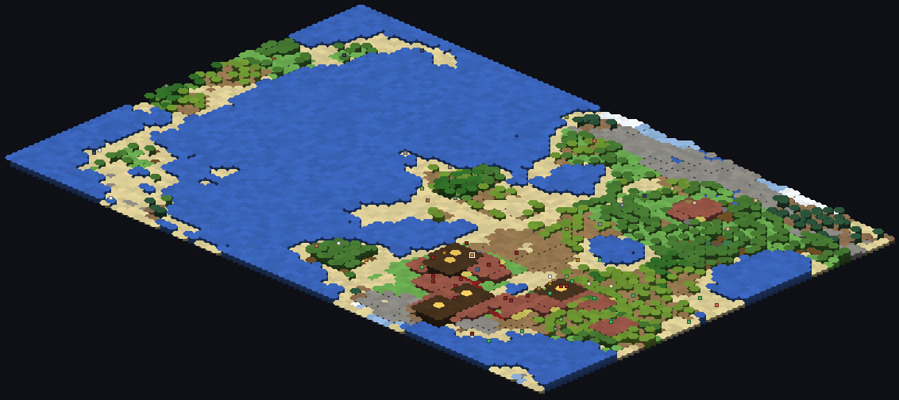
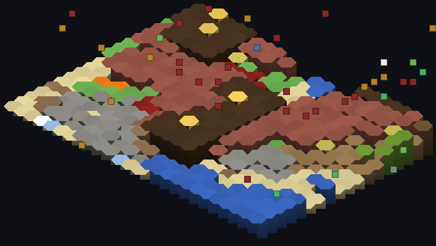

# worldforge in Minecraft: a WorldBox world, rendered in Minecraft

A WorldBox-style simulation running in Rust, drawn as blocks and mobs in Minecraft.

The simulation is [`worldforge`](../worldbox-rust-rewrite/) — the cleanroom Rust
rewrite of WorldBox's mechanics that lives next door. This example turns it into
something you can walk around in: it publishes the world over a socket on
`127.0.0.1`, and a Fabric mod turns every tile into a column of blocks, every
building into a small structure, and every creature into a Minecraft mob with a
name tag. Kingdoms are painted in their banner colour, wars and coronations scroll
past in chat, and the whole thing advances at a speed you choose — up to 60
simulated ticks per second.


*A 96×64 world at year 78: 12 villages, 3 kingdoms, 137 people. Purple/pink is a
kingdom of Orcs, green is the Elves, orange the Dwarves; the concrete edges are
territory borders and the diamonds are towns.*


*The same world, zoomed to one kingdom: town centres with bells, farms, walls and
roads, with the border tiles in the realm's colour.*

## What the simulation owns, and what Minecraft owns

Everything about the *world* comes from Rust. Everything about the *view* is
Minecraft's. The split is the design:

| Rust (`worldforge`) | Minecraft (`wfbox`) |
|---|---|
| hex world generation, terrain, biomes | the world it is built in |
| villages, buildings, kingdoms, diplomacy, wars, ages | the blocks those become |
| 49 god powers, disasters, wildlife, monsters | the mobs that stand for creatures |
| a deterministic `state_hash()` per tick | the boss bar, the chat news, the applier |
| the **mapping**: biome → block, tile → column height, building → structure, unit → mob, kingdom → concrete colour | nothing: the mod asks no questions |

That is deliberate: the mapping is the interesting, testable part, so it lives in
[`worldforge/src/bridge.rs`](../worldbox-rust-rewrite/worldforge/src/bridge.rs)
with unit tests over every biome, tree, building kind, mob and message. The mod
(about 900 lines of Java) only *applies* what it is told, which is why it can be
read in one sitting and cannot disagree with the simulation.

## Running it

Two processes: the simulation, and Minecraft.

### 1. The simulation

```bash
cd ../worldbox-rust-rewrite/worldforge
cargo build --release --offline
./target/release/worldforge serve --size large --seed 20241003 --civs 4 --animals 40 --tps 10
```

```
worldforge serve: 127.0.0.1:25607 | 96x64 seed 20241003 | 10 ticks/s | 64 units
worldforge serve: waiting for a Minecraft client (or `worldforge mcview`)
```

It listens on the loopback interface only. With no client attached it just runs
the world; a client can attach or leave at any time.

New to this? **You can see it without Minecraft.** `mcview` is the Minecraft side
without Minecraft — it speaks the same protocol, builds the same block world, and
draws it as an isometric picture:

```bash
./target/release/worldforge mcview --connect 127.0.0.1:25607 --scale 12 --timeout 20
./target/release/worldforge mcview --connect 127.0.0.1:25607 --png world --every 200 --scale 8
./target/release/worldforge mcview --connect 127.0.0.1:25607 --png zoom --region 58,40,26,18 --scale 16
```

`../worldbox-in-minecraft/run-artifacts.sh` does the whole dance (start a bridge,
render the world and a zoom, stop) and regenerates the pictures at the top of this
page.

### 2. Minecraft

```bash
cd mc && ./gradlew build          # needs JDK 25; produces build/libs/wfbox-0.1.0.jar
```

Install Fabric Loader 0.19.5+ for Minecraft 26.3 plus Fabric API, put the jar in
`mods/`, and start a world. **A superflat "void" world is the intended canvas** —
the bridge builds the map from y=64 upward, so it wants empty space east and south
of the origin. The first run writes `config/wfbox.json`:

```json
{ "port": 25607, "origin_x": 0, "origin_z": 0 }
```

Then, in game:

```
/wf status              what the bridge and the canvas are doing
/wf info                year, tick, population, kingdoms, state hash
/wf pause | resume      stop and start the simulation
/wf step 200            advance it by hand, one frame per step
/wf speed 30            ticks per second
/wf power nuke          cast a power at the tile you are standing on
/wf spawn Orc           drop a creature there
/wf origin              move the canvas to where you stand
/wf clear               wipe the canvas and every mob
```

The canvas is built where the config says, so the fastest start is: walk to open
empty ground, `/wf origin`, and watch it rise around you.

## What you see

- **Terrain.** Every biome has a block: grass plains, podzol forest, sand desert,
  mud swamp, sculk corrupted land, netherrack infernal land, purpur enchanted land,
  candy-stripe pink ground. Elevation becomes column height, rivers and lakes are
  water carved into the land, mountains are capped stone.
- **Trees and rubble.** Tiles with trees grow a trunk and a crown of the right
  wood; stone piles up as cobblestone; burning tiles have a campfire.
- **Kingdoms.** Territory is tinted with the kingdom's banner colour and its edges
  are drawn in the nearest concrete — so a realm has one outline, and two realms
  side by side show where the front line is.
- **Towns.** Each village centre is a coloured platform with a lantern and, once it
  has a hall, a bell. Buildings are small structures: houses of planks and brick,
  farms of farmland and wheat, mines with rails, docks on the water, temples of
  quartz and gold, towers, wells, statues and walls. **A building under
  construction is a single block of scaffolding that becomes the building** — you
  can watch a village grow.
- **People.** Villagers for civilians, an armoured mob for soldiers, a trader for
  leaders and kings (they glow, and their name tag shows hp). Animals and monsters
  map to the closest thing Minecraft has; a dragon is an ender dragon.
- **News.** The god view is the boss bar (year, population, villages, kingdoms,
  current age) and the chronicle: `Year 44: Dominion of Yensari and Realm of Balhold
  make peace` arrives in chat as it happens.

## Driving the world from the host side

The bridge takes commands, so anything that can open a socket can play god —
including your own scripts. `host/mcview.py` is a small Python client for exactly
that, and it checks the protocol's invariants while it watches (tile counts, unique
unit ids, village counts matching the arrays):

```bash
python3 host/mcview.py --port 25607
# then:  power nuke     (at a random land tile)
#        power lightning 40 30
#        spawn Orc soldier 40 30
#        pause / resume / step 20 / speed 30
```

The same commands are what the mod's `/wf` commands send, and what the Rust tests
in `worldforge/tests/mc.rs` drive over a real socket.

## The protocol

JSON lines over TCP on `127.0.0.1:25607`. Index-based and append-only; block
*and* entity names share one palette the server sends on connect.

```jsonc
// server -> client, once per connection, in this order
{"t":"hello","protocol":1,"size":[96,64],"base_y":64,"sea_level":3,"canvas_top":108,
 "palette":["air","water", ...],"tag":"wfbox"}
{"t":"tiles","surface":[i...],"h":[i...],"top":[i...],"water":[0|1..],"extra":[[ids...]...]}
{"t":"structures","ops":[[x,y,z,block]...]}
{"t":"frame","tick":1561,"year":78,"pop":137,"village_count":12,"kingdom_count":3,
 "age":"Age of Hope","hash":"0x6b03761b5c0e2737",
 "units":[[id,mob,col,row,y,hp,max_hp,glow,"name","#rrggbb"]...],
 "villages":[[id,"Narcliff","Human",12,73,13,-1,100,0]...],
 "kingdoms":[[0,"Urzhowl Empire","#8c2828",54,1,2,15]...],
 "news":[[44,"Dominion of Yensari and Realm of Balhold make peace"]...]}

// then per tick, only when something changed
{"t":"edits","tiles":[index, tile, index, tile, ...]}

// client -> server
{"t":"ping"} {"t":"tiles"} {"t":"pause","on":true} {"t":"step","ticks":20}
{"t":"speed","tps":30} {"t":"power","name":"nuke","col":40,"row":30}
{"t":"spawn","race":"Orc","soldier":true,"col":40,"row":30}
```

`hash` is worldforge's `state_hash()`: the same seed and the same commands produce
the same number in the game as in the terminal, which is how you know the world in
Minecraft is the world the terminal is simulating.

Two things the mod deliberately does **not** do: it never decides anything about
the world, and it never edits your own world's terrain (the canvas is air it
places itself, and `/wf clear` takes it away again).

## Safety

- The bridge binds `127.0.0.1` only, and takes commands from anyone on the machine
  — no authentication, exactly like the GTA V passthrough link. Close the bridge
  when you are done.
- Offline, single player, your own world. Nothing here talks to a Mojang service,
  and nothing from WorldBox or Minecraft is shipped: the mod *is* the renderer,
  and every asset it uses is one Minecraft already has.
- The mod keeps its entities tagged `wfbox`, so `/kill @e[tag=wfbox]` cleans up
  after it (and `/wf clear` does the same plus the terrain).

## What is not done yet

- **Not playtested in Minecraft.** It was built against the same 26.3 API the
  GTA V passthrough in this repo targets and verified end to end with `mcview` and
  a Python client, but no one has run it in a real client — the compile would be
  the first thing to fix on a different Minecraft version, since 26.3 ships
  unobfuscated and names change.
- **No mob AI.** Creatures are markers: they move when the simulation moves them,
  they are invulnerable, and they never fight. Making Minecraft fights mean
  something would need the damage to travel back to the sim (the passthrough
  example's mob proxy is the place to look).
- **The canvas is fixed at world load.** `/wf origin` moves it, but a restart is
  needed if you move far; a rolling canvas that follows the player is on the list.
- **Territory is interleaved.** worldforge claims land per village, so a kingdom's
  land is not one blob and the borders show it. Making realms consolidate their
  territory is a simulation change, not a rendering one, and it would change the
  state hash.

## Credits

- The simulation: [`examples/worldbox-rust-rewrite`](../worldbox-rust-rewrite/),
  a cleanroom reimplementation — no WorldBox files, no decompiled code.
- Fabric, Loom, and Fabric API. Minecraft belongs to Mojang Studios and Microsoft;
  WorldBox to Maxim Karpenko. This is a fan project that ships none of their code
  or assets.
